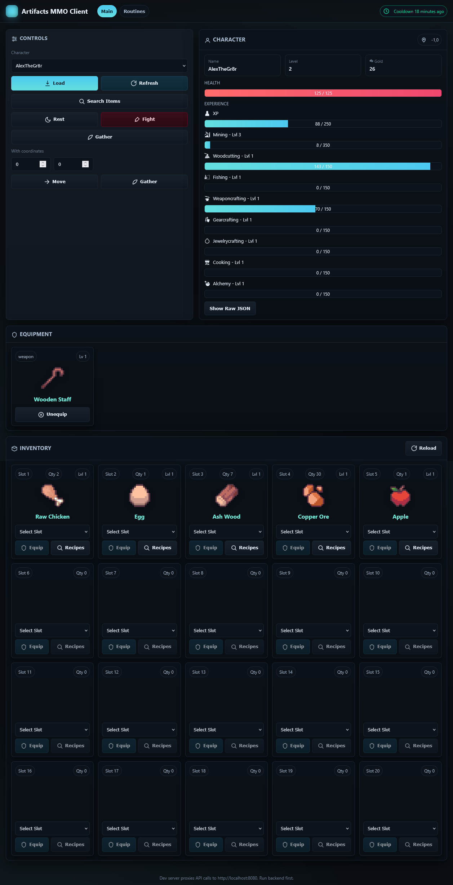
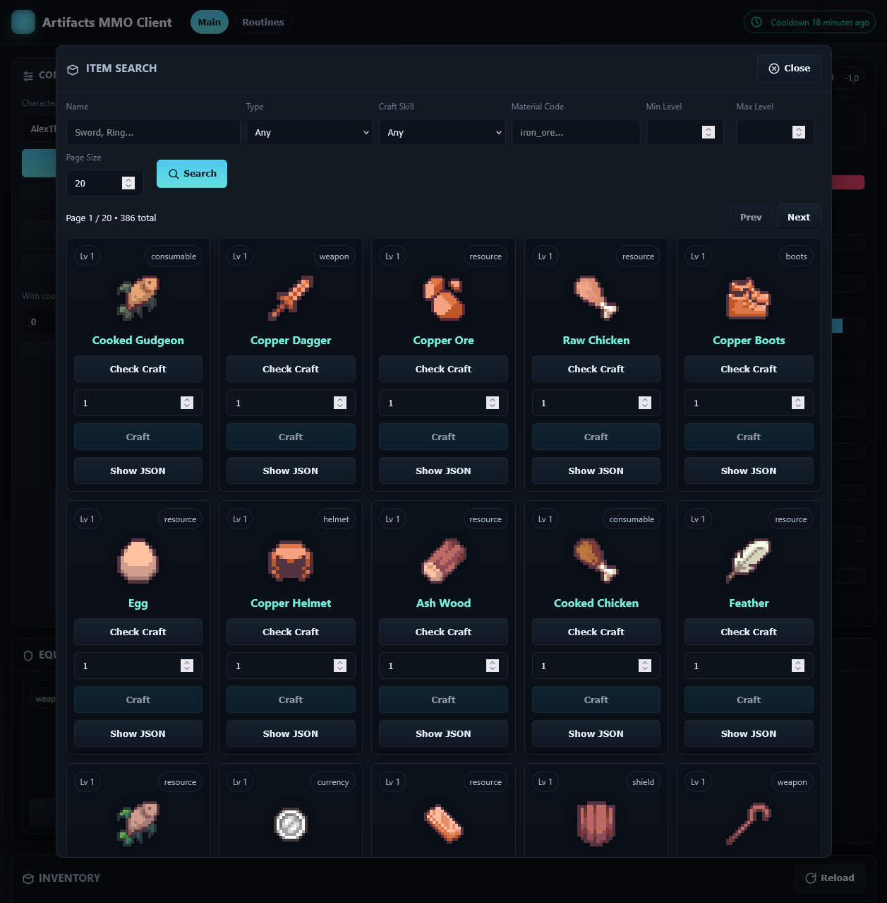
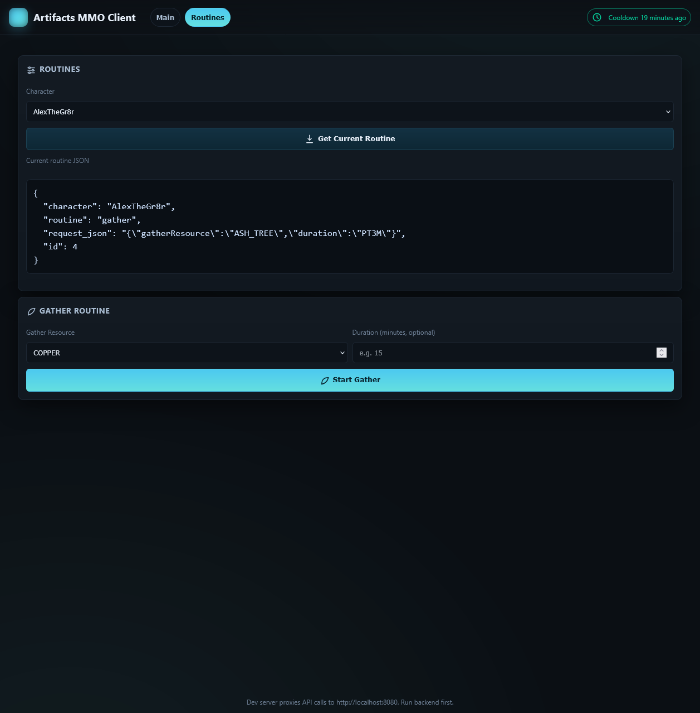

# Artifacts MMO Client

This is a client for the Artifacts MMO, which is an API-based MMO. This project interacts with
that API via a Spring Boot backend using Kotlin. The frontend is a React app that talks to the 
Spring Boot backend.

This is all still a work in progress so expect bugs and constant changes. This is also still a 
hobby project so expect some cut corners.

The frontend is primarily written using AI assistance, so expect a lack of quality there.

# Screenshots

---

---

# How to Build and Run

1. Setup your `.env` file by copying/renaming `.env.example` and filling in the values.
    - Or manually set the environment variables.
2. Run the backend via the preconfigured IntelliJ run configuration.
    - Or manually run `gradle bootRun` if you have your environment variables set.
3. Build and run the frontend. Refer to the frontend [README](frontend/README.md) for more details.

